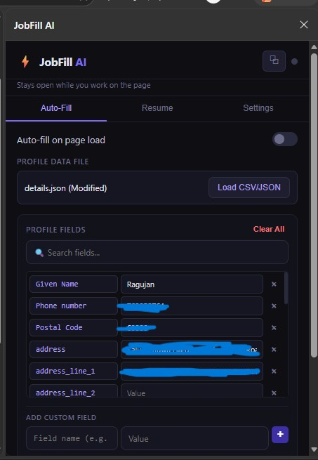
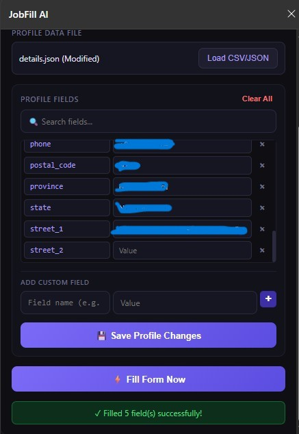
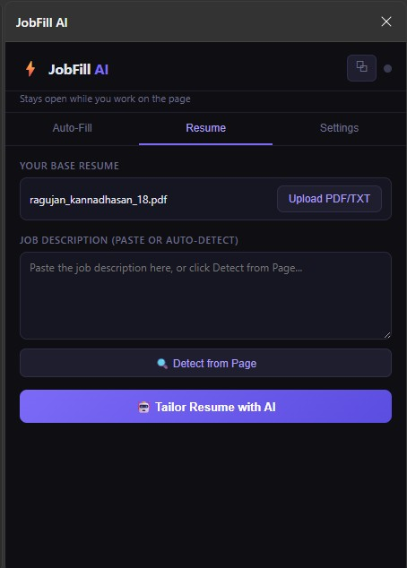
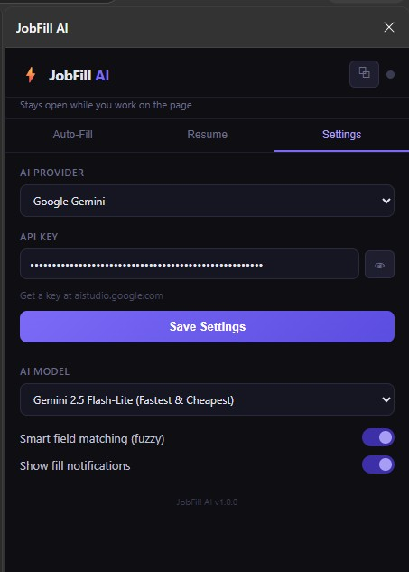

# ⚡ JobFill AI — Edge Extension

Auto-fill job application forms + AI-powered resume tailoring.

---

## 📸 Screenshots

### Auto-Fill tab

Load your profile from CSV/JSON, review and edit fields, then fill job forms in one click.

<p align="center">
  
  
</p>

### Resume tab

Upload your base resume, paste or auto-detect the job description, and tailor it with AI.

<p align="center">
  
</p>

### Settings tab

Choose your AI provider, add your API key, pick a model, and toggle smart matching.

<p align="center">
  
</p>

---

## 📦 Installation (Microsoft Edge)

1. Open Edge and go to: `edge://extensions/`
2. Enable **Developer mode** (toggle in the bottom-left)
3. Click **"Load unpacked"**
4. Select the `job-autofill-extension` folder
5. The ⚡ icon will appear in your toolbar — pin it!
6. Click the icon to open JobFill in the **side panel** — it stays open while you copy text from job pages

---

## 🚀 Quick Start

### 1. Set up your profile data
Edit `my-profile.csv` (or `my-profile.json`) with **your real info**.

**CSV format** (one field per line):
```
first_name,Your First Name
last_name,Your Last Name
email,your@email.com
phone,+1-555-000-0000
...
```

**JSON format** (also supported):
```json
{
  "first_name": "Your First Name",
  "email": "your@email.com"
}
```

### 2. Load your profile into the extension
- Click the ⚡ icon → **Auto-Fill tab**
- Click **"Load CSV/JSON"** → select your profile file

### 3. Fill a form
- Open any job application page
- Click the ⚡ icon → **"⚡ Fill Form Now"**
- OR enable **"Auto-fill on page load"** to fill automatically

### 4. AI Resume Tailoring
- Click the ⚡ icon → **Resume tab**
- Upload your base resume (PDF or TXT)
- Paste the job description OR click "🔍 Detect from Page"
- Click **"🤖 Tailor Resume with AI"**
- Copy or download the tailored version

### 5. Add your AI settings (for resume tailoring)
- Click ⚡ → **Settings tab**
- Choose your **AI Provider** (Anthropic, OpenAI, Gemini, OpenRouter, Ollama, or Custom)
- Paste your API key (not required for local Ollama)
- Select a model and click **Save Settings**

| Provider | Get an API key |
|----------|----------------|
| Anthropic | https://console.anthropic.com |
| OpenAI | https://platform.openai.com |
| Google Gemini | https://aistudio.google.com |
| OpenRouter | https://openrouter.ai |
| Ollama | Run locally — no key needed |
| Custom | Any OpenAI-compatible endpoint |

**PDF resumes** are supported on **Anthropic** and **Gemini**. For other providers, upload a `.txt` file.

---

## 📋 Supported Profile Fields

| Key | Description |
|-----|-------------|
| `first_name` | First name |
| `last_name` | Last name |
| `full_name` | Full name |
| `email` | Email address |
| `phone` | Phone number |
| `address` | Street address |
| `city` | City |
| `state` | State/Province |
| `zip` | ZIP/Postal code |
| `country` | Country |
| `linkedin` | LinkedIn URL |
| `github` | GitHub URL |
| `portfolio` | Portfolio/website |
| `current_title` | Current job title |
| `current_company` | Current employer |
| `years_experience` | Years of experience |
| `salary_expectation` | Expected salary |
| `availability` | Start date / availability |
| `notice_period` | Notice period |
| `cover_letter` | Cover letter text |
| `summary` | Professional summary |

You can also add **custom fields** — the extension will fuzzy-match them.

---

## 🌐 Supported Job Sites
- LinkedIn
- Indeed
- Greenhouse
- Lever
- Workday
- Jobvite
- SmartRecruiters
- Generic ATS forms on company career pages

---

## 🔒 Privacy
- All your data stays **local** on your computer (browser storage)
- Your resume and API key are **never sent anywhere** except directly to your chosen AI provider when you click "Tailor Resume"
- No tracking, no analytics
